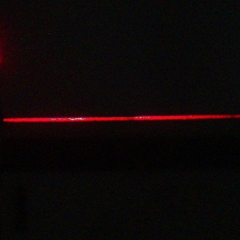
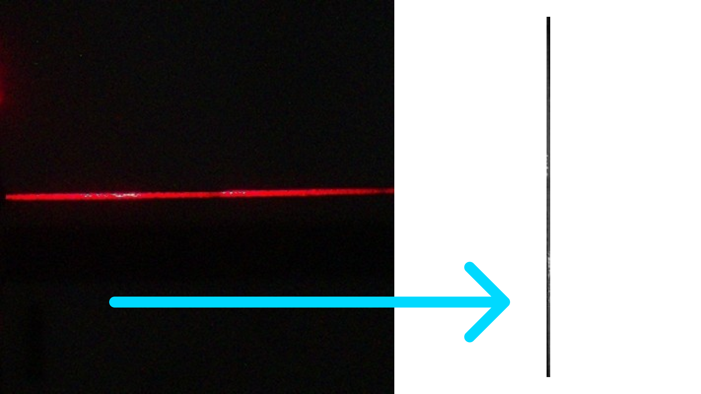
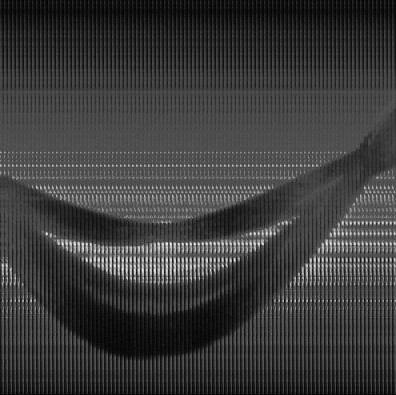
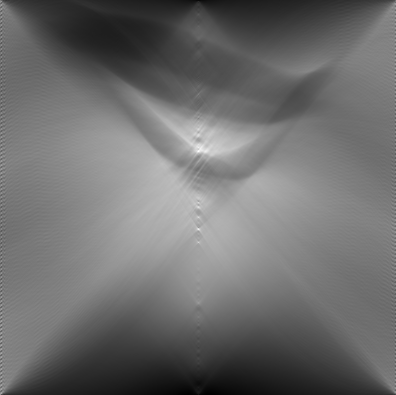
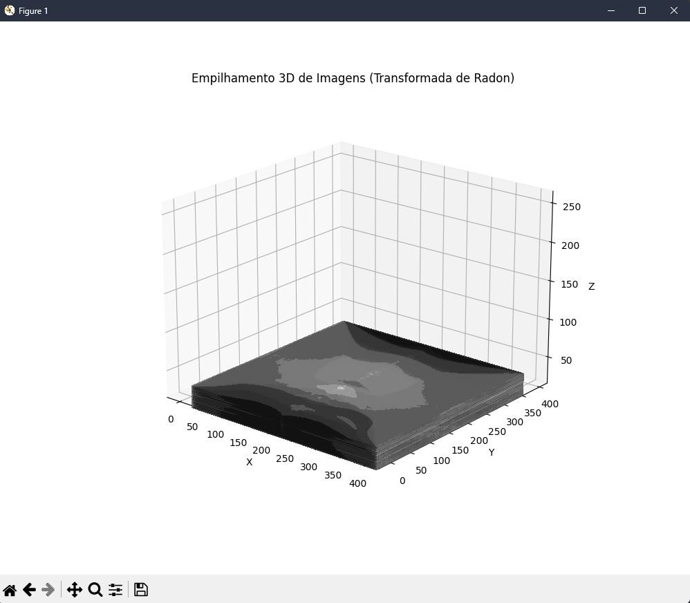

# **Tomografia com Transformada de Radon**

`Matéria:` Física Elétrica

`Professores:` Jorge e Ricardo Dalke

`Alunos:` 
- Alice Vitoria Boschtti
- Gabriel Frigo Sena Silva
- Giovanna Boschetti Fernandes
- Juan Carlos Hernandez

---

## Índice
1. [O que é Tomografia?](#o-que-é-tomografia)
2. [Estrutura do Projeto](#estrutura-do-projeto)  
   - [run.py](#1-runpy)
   - [transform.py](#2-transformpy)
   - [sinogram.py](#3-sinogrampy)
   - [radon.py](#4-radonpy)
   - [chart.py](#5-chartpy)
3. [Como instalar as dependências?](#como-instalar-as-dependências)

**Observação**: Por limites da quantidade de arquivos do GitHub, não foi colocada a pasta principal com 2999 fotos tiradas para o procedimento da tomografia. Para baixá-las, acesse o link:
[Google Drive - Fotos](https://drive.google.com/file/d/1WLI-9Hl5eoMzAM7jXUApzqQesvEKv-oW/view?usp=sharing). Após baixar as imagens, coloque-as em uma pasta chamada "raw_images" (é importante que seja este nome).

---

## O que é Tomografia?

A tomografia é um método de imagem utilizado para reconstruir estruturas tridimensionais a partir de projeções bidimensionais, amplamente usada em áreas como medicina, engenharia e geofísica. A **Transformada de Radon** é uma ferramenta matemática essencial neste processo, pois converte projeções (sinogramas) em informações sobre a estrutura interna do objeto, permitindo a reconstrução volumétrica.

---

## Estrutura do Projeto

### 1. **`run.py`**
- **Função**: Arquivo principal que integra todas as etapas do projeto, desde o pré-processamento das imagens até a geração dos resultados. 
- **Descrição**:
  - Executa as transformações iniciais nas imagens.
  - Gera sinogramas organizados.
  - Aplica a Transformada de Radon.
  - Gera um gráfico 3D das imagens processadas.
  
  

### 2. **`transform.py`**
- **Função**: Realiza o pré-processamento das imagens originais.
- **Etapas**:
  - Converte as imagens para escala de cinza.
  - Rotaciona as imagens em 90°.
  - Corta os limites em torno do feixe de luz para destacar a região relevante.
- **Saída**: Imagens tratadas armazenadas em `./images_transformed`.



### 3. **`sinogram.py`**
- **Função**: Gera sinogramas a partir das imagens processadas.
- **Etapas**:
  - Agrupa as imagens tratadas em conjuntos de 99, criando colagens horizontais.
  - Corrige sinogramas invertidos com base no índice da imagem.
- **Saída**: Sinogramas armazenados em `./sinogram`.



### 4. **`radon.py`**
- **Função**: Aplica a Transformada de Radon a cada sinograma.
- **Etapas**:
  - Realiza a transformada com projeções de 0° a 180°.
  - Normaliza os resultados para o intervalo de 0 a 255.
  - Salva as imagens processadas.
- **Saída**: Imagens da Transformada de Radon armazenadas em `./radon`.



### 5. **`chart.py`**
- **Função**: Cria um gráfico 3D interativo das imagens processadas.
- **Etapas**:
  - Empilha as imagens da Transformada de Radon em um volume 3D.
  - Gera contornos em cada camada, permitindo a exploração visual.
- **Saída**: Gráfico interativo exibido no matplotlib.



---

## Como instalar as dependências?

1. Certifique-se de que o Python 3.8 ou superior está instalado no seu sistema.
2. Recomendamos o uso de um ambiente virtual:
   ```bash
   python -m venv venv
   source venv/bin/activate  # Linux/Mac
   .\venv\Scripts\activate   # Windows
